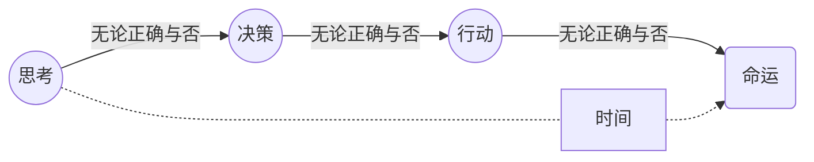
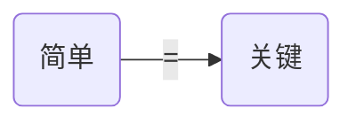

## 00.改变想法即改变生活

无论正确与否人们都会思考，也无论如何无法阻止自己的“思考”。这思考会引发“决策”而后带来行动，进而构成命运，于是到最后每个人其实都是自己思考的结果。

**人们看起来无比复杂的“思考”其基石只不过是一个又一个基础且又简单的“概念”，于是对那些基础且又简单的概念的“理解”总是在暗中起着决定性的作用。**举个例子，当坏事发生的时候比如“重病”或者“车祸”，人们对“命运”的这个概念的理解会影响随后的每一个决策，每个行动，进而等同于直接且完整地影响自己的“命运”。

那有些人是不信命的，他们可能压根不会把自己正在经历的坏事与“命运”这个概念联系在一起。他们的想法是**一方面“这就是个概率问题，差的概率被我遇到了”，另外一一方面“这的确与自己过往的某些判断有关”。于是他们能正常处理那些坏事，而后改进的方向也很明确“未来如何降低坏事发生的概率？”以及“我应该如何改善自己的判断呢？”**

当然了在普通民众之中有相当一部分“信命”的人，他们会认为这事自己“命不好”或者“得罪了神灵”由此进一步想很多且做很多。“不信命”的人压根不会去做的事情，对他们来说既然“命运”以及注定，那么自己的“思考”是毫无意义的，进而既然“决策”并不属于自己也就没有改进的必要。至于怎么做，需要的是“求神拜佛”获得的指引于是他们行动自然而然变成了“不由自主”，到最后“命运”也就好像真的早已“注定”了一样。那同样的道理很多人终其一生也没怎么赚到钱，甚至在当下越来越好的时代里依然如此。可事实上真正限制他们的往往并不是什么“不公平”或者“没机会”，而是**他们的底层观念错了**而已。就是那些基础且又不仅看起来“简单”，事实上也的确“简单”的东西暗中决定了他们的所谓的“命运”。

**关于“财富的真相”当我们细说从头之时，一切看起来都非常“简单”。但，有必要事先提醒，正因为它们如此简单，所以它们才如此地关键。**请你相信我，虽然我们只能从“简单”到“显而易见”的事实开始，但随着思考一步一步深入，一定有很多“情理之中意料之外”的“事实”浮现出来。它们恰恰就是“改变生活”的关键，又恰恰因为它们实在“太简单了”，所以“不知道”或者“没想过”也就实在“太可惜了”。且那些“简单至极”的东西暗中深刻影响的竟然是人们误以为的“困难至极”的“赚钱”。反过来也恰恰因为简单，一个人一旦“知道”甚至可能只需要“听到”或者“见到”就真的有可能做到。而随后的慨叹即自然又一致，除了觉得万幸之外都会不由自主地向家人分享。
